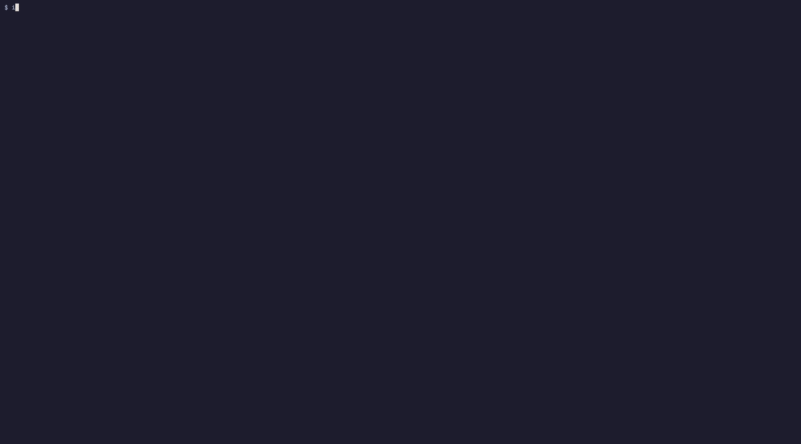

# iae — Integrated Agentic Environment


> One command, four tools: **editor**, **coding agent**, **shell** and **git**,
> in a tmux workspace that re-lays itself out as you resize the terminal.



Inspired by craftzdog's tmux+editor setup. Built for
[Omarchy Linux](https://omarchy.org) (it picks up your Omarchy defaults
automatically), but it runs on any Linux or macOS machine with `tmux`.

## Quick start

```sh
git clone https://github.com/KitsuneSemCalda/iae.git
cd iae && ./install.sh
cd ~/code/myproject && iae
```

Not on Omarchy? Pick your tools with `IAE_AGENT`, `IAE_EDITOR` and `IAE_GIT`
(see [Configuration](#configuration)).

## What you get

Each tool has a fixed role, regardless of how the panes are arranged:

| Pane | Tool |
|------|------|
| **editor** | Omarchy's default editor (`omarchy default editor`) when it's a TUI editor (nvim, vim, nano, micro, helix); `nvim` otherwise |
| **agent** | Omarchy's default coding agent (`omarchy agent --inline`, set with `omarchy default agent <name>`) |
| **shell** | free, your system's default shell |
| **git/logs** | `tig`, falling back to `lazygit` |


<details>
<summary>More: tig in the git/logs pane</summary>


</details>

### Responsive layout

The arrangement adapts to the terminal size, and keeps adapting live as you
resize — the same editor/agent/shell/git tools just get re-laid-out
in-place, without restarting anything:

| State     | Terminal size            | Layout                                                              |
|-----------|---------------------------|---------------------------------------------------------------------|
| `wide`    | ≥180 cols and ≥45 lines   | The layout above: large editor, agent to the side, shell/git below |
| `grid`    | ≥120 cols and ≥34 lines   | Even 2×2 grid — every tool gets usable space                       |
| `compact` | below that                | Two tmux windows: `work` (editor + agent) and `inspect` (shell + git) |

Below the `grid` threshold there just isn't room for four simultaneous
panes to be useful, so `compact` trades simultaneity for two full-width
windows you switch between (`prefix` + window number, as usual in tmux).

## Installation

The [Quick start](#quick-start) above is all most people need. In detail: clone the repository, then run the installer:

```sh
git clone https://github.com/KitsuneSemCalda/iae.git
cd iae
./install.sh
```

This installs a standalone executable in `~/.local/bin` (already on `PATH`
by default on Omarchy), including its shell libraries. You can move or
remove the clone afterward. Reinstalling also replaces the old symlink
installation. To install somewhere else, pass the destination as an argument:

```sh
./install.sh ~/bin
```

### Updating

```sh
cd path/to/iae
git pull
./install.sh
```

Run the installer again after pulling changes (or cloning a fresh copy).
Use the same destination argument if you installed somewhere else.

### Uninstalling

```sh
./install.sh --uninstall            # removes ~/.local/bin/iae
./install.sh --uninstall ~/bin      # if you installed somewhere else
```

If you already deleted the clone, remove the installed executable directly:
`rm ~/.local/bin/iae` (or your custom destination).

## Usage

```sh
iae [project-path]
```

With no argument, uses the current directory. Running it again on the same
project reattaches to the existing session instead of duplicating the
panes. The session name is derived from the project's canonical path (not
just the folder name), so different projects sharing a directory name
(e.g. two `src/`) don't collide, and symlinks to the same project reattach
to the same session.

## Configuration

`iae` works out of the box on Omarchy, and on any other Linux/macOS box with
`tmux`. Each pane's tool is resolved in this order:

| Pane   | Override      | Then                                                                  |
|--------|---------------|-----------------------------------------------------------------------|
| editor | `IAE_EDITOR`  | Omarchy's default (TUI editors only), `$VISUAL`, `$EDITOR`, `nvim`, `vim`, `nano` |
| agent  | `IAE_AGENT`   | the Omarchy default agent, else the first of `claude`, `codex`, `opencode`, `gemini`, `aider` on `PATH` |
| git    | `IAE_GIT`     | `tig`, then `lazygit`                                                 |
| shell  | —             | your default shell                                                    |

```sh
IAE_AGENT="claude --resume" IAE_EDITOR=hx iae ~/code/myproject
```

Other commands: `iae --help`, `iae --version`.

## Dependencies

- `tmux` (required)
- at least one of `tig` or `lazygit`
- a TUI editor (`nvim`, `vim`, `nano`, `helix`, ...)
- a coding agent CLI (Omarchy's default agent, or any of the ones listed above)

On Omarchy all of these are wired up already; elsewhere, install them and
optionally set the `IAE_*` variables above.

## Troubleshooting

- **`iae: no coding agent found`** — install one of the supported agents or set `IAE_AGENT`.
- **`iae: dependency 'tig' or 'lazygit' not found`** — install either one (e.g. `sudo pacman -S tig`, `sudo apt install tig`, `brew install tig`).
- **Editor pane is idle** — your configured editor is a GUI app; set `IAE_EDITOR` to a terminal editor.
- **`iae` command not found** — make sure `~/.local/bin` is on your `PATH`.
- **Panes look wrong after resizing** — `iae` reflows automatically via tmux's `window-resized` hook; needs tmux ≥ 3.0.

## Testing

```sh
bash -n iae install.sh lib/layout.sh tests/*.sh      # syntax check
shellcheck -x -P SCRIPTDIR iae install.sh lib/layout.sh tests/*.sh
./tests/tools.sh                                  # editor/agent/git resolution,
                                                   # with and without `omarchy`
./tests/layout.sh                                 # unit tests for the
                                                   # wide/grid/compact state
                                                   # machine (lib/layout.sh)
./tests/smoke.sh                                  # launches the real iae
                                                   # against a scratch git
                                                   # repo and a live resize,
                                                   # both on an isolated
                                                   # tmux server
```

The same checks run in CI on every push (see `.github/workflows/ci.yml`).

## Regenerating the demo and screenshots

The GIF is scripted with [VHS](https://github.com/charmbracelet/vhs), so it
can be re-recorded whenever the UI changes:

```sh
vhs assets/demo/demo.tape   # needs vhs, ttyd, ffmpeg, tmux, tig/lazygit, nvim
```

It runs on a private tmux server and a stub agent (`assets/demo/bin/`), so it
never touches your real sessions or shows a real agent's output.

## Contributing

See [CONTRIBUTING.md](CONTRIBUTING.md).

## License

See [LICENSE](LICENSE).
