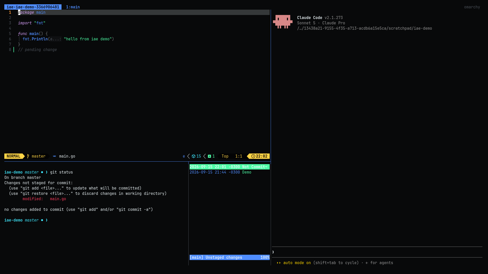
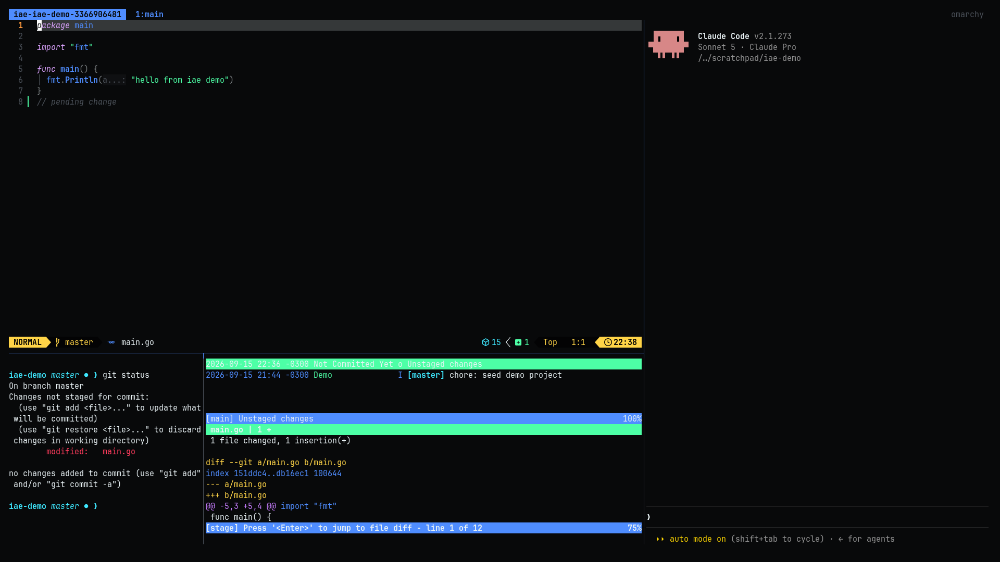

# iae


TUI environment for agentic development, inspired by craftzdog's tmux+editor
setup, built to run on [Omarchy Linux](https://omarchy.org).

A single script (`iae`) sets up a tmux session with 4 fixed panes:

- **editor** — Omarchy's default editor (`omarchy-default-editor`), when it's a TUI editor (nvim, vim, nano, micro, helix); falls back to `nvim` otherwise
- **agent** — Omarchy's default coding agent (`omarchy-agent`, configurable via `omarchy default agent <name>`)
- **shell** — free, the system's default shell
- **git/logs** — `tig`, falling back to `lazygit` if `tig` isn't installed





## Installation

```sh
./install.sh
```

Creates a symlink for `iae` in `~/.local/bin` (already on `PATH` by default
on Omarchy), making the command available from any directory. Works no
matter where you run it from — it resolves its own path, not the shell's
current directory. To install somewhere else, pass the destination as an
argument:

```sh
./install.sh ~/bin
```

## Usage

```sh
iae [project-path]
```

With no argument, uses the current directory. Running it again on the same
project reattaches to the existing session instead of duplicating the
panes. The session name is derived from the project's canonical path (not
just the folder name), so different projects sharing a directory name
(e.g. two `src/`) don't collide, and symlinks to the same project reattach
to the same session.

## Dependencies

`tmux`, `nvim` and `omarchy-agent` need to be on `PATH` (default on any Omarchy install), plus at least one of `tig` or `lazygit`.
